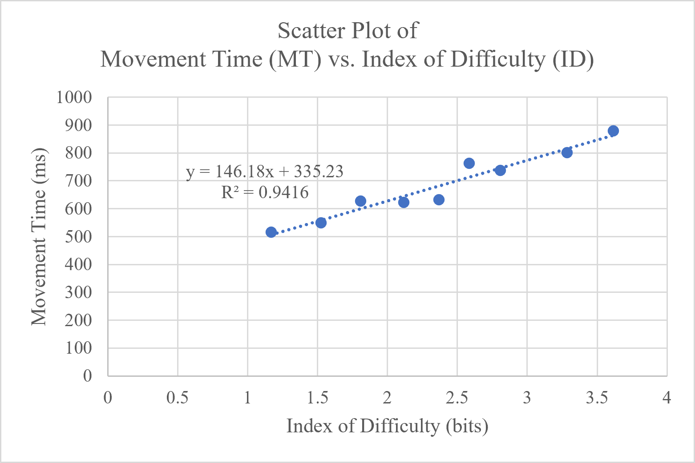

# Ad Blocker Agent - Fitts’ Law Experiment

## 1. Introduction

This project is an interactive game designed and implemented based on Fitts’ Law with a realistic usage scenario. With the assistance of Generative AI, an HTML/JavaScript web application was developed to vary the `Target Distance (A)` and `Target Width (W)` while recording the `Movement Time (MT)` required for the user to successfully click the target.

This experiment transforms the traditional Fitts’ Law pointing task into an interactive experience with a game-based scenario. User performance data are collected through actual interaction and then used to establish a Fitts’ Law model.

## 2. Scenario & Design Motivation

### Ad Blocker Agent

The idea for this experiment came from a common frustration in everyday computer use: **closing pop-up windows can be annoying, especially when the close button is small or difficult to reach**. Although clicking an “X” seems like a simple task, users often need to carefully position the cursor over a small target before clicking it.

Based on this experience, the **Ad Blocker Agent** scenario was designed. The user plays the role of an Ad Blocker Agent responsible for protecting a computer system. Simulated malicious advertisement pop-up windows continuously appear on the screen, and the user must quickly locate and click the “X” close button in the upper-right corner of each pop-up window.

The repeated interaction with pop-up windows provides a natural context for a Fitts’ Law experiment. The size and position of the pop-up windows can be systematically changed, causing the distance and size of the close button to vary between experimental conditions. This allows the game scenario to maintain the basic pointing task required by Fitts’ Law while making the interaction more similar to everyday computer use.

## 3. Application

The experimental application is implemented as a single HTML/JavaScript file. Each trial displays a pop-up window that needs to be closed, and the user must click the “X” button in its upper-right corner. There are nine trials, and each trial requires eleven successful clicks. However, the first click of each trial does not affect the results, as the travel distance would be different from the rest of the trial.

The experiment varies:

* `Target Distance (A)`: The movement distance between the cursor and the close button.

* `Target Width (W)`: The effective clickable width of the close button.

After each successful click, the system immediately ends the current trial and starts the next condition, allowing different combinations of target distance and target width to be tested.

To collect experimental data, the system provides a CSV export function. The exported data include:

* Average of 10 Trials

* Average Distance (pixels)

* Width (pixels)

* Index of Difficulty (bits)

* Average Time (milliseconds)

The Index of Difficulty is calculated according to Fitts’ Law:

$$
ID = \log_2\left(\frac{A}{W}+1\right)
$$

## 4. Website & Demo Video

- [Webstie URL](https://hsinyuchao.github.io/Ad-Blocker-Agent/ "Ad-Blocker-Agent")
- [Demo video URL](https://drive.google.com/file/d/1JBNYiog-bjBaocaBt3ffuINA0M70Og6a/view?usp=sharing "Demo Video")

## 5. Experiment & Data Analysis

The collected data were analyzed to examine the relationship between `Index of Difficulty (ID)` and `Average Movement Time (MT)`. `ID` was used as the independent variable, while `MT` was used as the dependent variable. A scatter plot was generated to visualize their relationship.

The following shows the results of the demo video.

  

The linear model of Fitts’ Law is:

$$
MT = a + b \times ID
$$

where:

* `MT`: Movement Time, measured in milliseconds

* `ID`: Index of Difficulty, measured in bits

* `a`: The intercept, representing the basic operation time independent of target difficulty

* `b`: The slope, representing the change in Movement Time as the Index of Difficulty increases

Linear regression was performed on the experimental data to estimate `a = 335.232` and `b = 146.18`. These empirical parameters were then used to establish the Custom Fitts’ Law Formula for this experiment:

$$
MT = 335.232 + 146.18 \times
\log_2\left(\frac{A}{W}+1\right)
$$

The resulting `R² = 0.9416`, indicating a strong linear relationship between `ID` and `MT` in the experimental data.

The scatter plot below provides a visual representation of this relationship.

  

## 7. Real-World HCI Problem

The repeated task of closing pop-up windows highlights a broader HCI problem: **small and frequently accessed controls can require unnecessary pointing precision and effort**. This is particularly noticeable when users repeatedly need to close temporary windows, even though each individual interaction is relatively simple.

### Infinite Edge Effect

An important concept related to this problem is the Infinite Edge Effect:

> Infinite Edge Effect means targets placed at the edge or corner of the display effectively have an infinitely large target boundary (infinite `W`) in the direction beyond the screen, drastically reducing the time it takes to reach them.

This principle is particularly useful for full-screen windows. For example, a close button placed in the upper-right corner of a maximized window can be reached by simply moving the cursor toward the corner of the screen. The screen boundary prevents the cursor from overshooting the target, effectively making the target easier to acquire than an identical-sized target located away from the screen edge.

### Future Design Possibility

However, small pop-up windows generally do not benefit from the same effect. Their close buttons are usually positioned slightly inside the window boundary, while the boundary itself does not prevent the cursor from moving past the target. The repeated difficulty of clicking these buttons in the Ad Blocker Agent game raises a potential design question: **could the boundary of a small pop-up window provide some form of assistance similar to the Infinite Edge Effect?**

One possible approach would be to introduce a **slight physical or interactive constraint around the boundary of a pop-up window.** For example, the cursor could gradually slow down when approaching the edge of a small pop-up window, creating a subtle “resistance” that helps guide the cursor toward the close button. Other forms of boundary-based interaction could also be explored, such as a small amount of cursor resistance or a virtual barrier around the window.

Such a design could potentially make frequently used controls in small pop-up windows easier to acquire without simply increasing the visible size of the close button. This idea could be applied to notifications, dialogs, floating tools, or other temporary UI elements that require users to repeatedly locate and close small controls.

Therefore, the Ad Blocker Agent experiment uses a familiar everyday interaction as a starting point for exploring how screen boundaries, target size, and cursor movement constraints can influence pointing performance, and how the benefits of the Infinite Edge Effect might potentially be extended to small pop-up interfaces.

## Credits

Course: NTHU Human-Computer Interaction (2026)

No modification, redistribution, or commercial use of this work is permitted without explicit prior written consent from the authors. This project is hosted on GitHub strictly for educational and viewing purposes.
